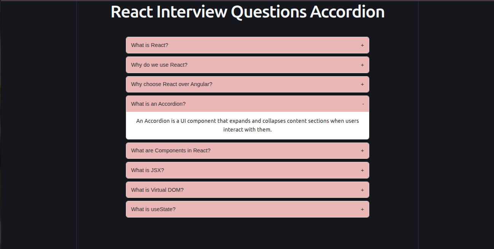

### Day 1 - Accordion

A reusable accordion component displaying React interview questions.

### Concepts Covered

- React Components
- Props
- useState
- Conditional Rendering
- Event Handling
- Component Reusability

## Tech Stack

- React
- JavaScript
- CSS
- Vite

## Screenshot

  

